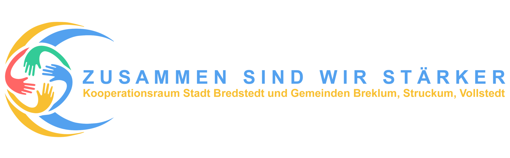

# We:Connect

[Deutsche Fassung](README-de.md) · [English Version](README.md)

## Resumé

Under den foreløbige arbejdsbetegnelse "We:Connect" skal der udvikles koordinerede API'er, med hvilke

* udbydere af offentlig transport
* pendultjenester
* biludlejningsfirmaer
* udlejningsfirmaer for e-bikes
* privatpersoner
* ...

kan oplyse deres ruter, tilgængelighed, tidsplaner, kapaciteter og priser, og på hvilkes grundlag der kan udvikles apps,
der

* muliggør regional og overregional ruteføring på tværs af udbydergrænser
* giver mulighed for enkle reservationer
* kan integreres i "landsby-apps".
* ...

## Hvorfor bekymre sig?

Som en del af Bredsted bys samarbejdsområde med kommunerne Breklum, Strukum og Folsted i Nordfrisland i Sydslesvig blev
projektet "[Smart Marketplace for Future Mobility](https://www.smarter-marktplatz-bredstedt.de/)" oprettet med henblik
på at løse følgende spørgsmål:

* Hvordan vil vi komme rundt på landet om ti år?
* Hvordan kan vi gøre mobiliteten økologisk og komfortabel på samme tid?
* Og hvordan hænger udbuddet af fødevarer, sundhedstjenester og fritidsfaciliteter i landdistrikterne sammen med
  mobiliteten?

Det blev meget hurtigt klart, at vi har brug for løsninger, der i det mindste gør den anden bil overflødig i
landdistrikterne uden at begrænse mobiliteten. For at opnå dette skal alle borgere let kunne finde ud af, hvilke
transportalternativer der findes.

Den oprindelige idé var at skabe en app, der opsummerer de regionale tilbud. Det blev imidlertid hurtigt klart, at der
under de nuværende omstændigheder ikke kan findes en app, der løser dette problem tilfredsstillende: Der mangler
standardiserede grænseflader.

Formålet med dette projekt er at definere en sådan grænseflade - eller mere præcist: en samling af grænseflader - som er
lige åben for alle transporttjenesteudbydere og alle app-udbydere.
