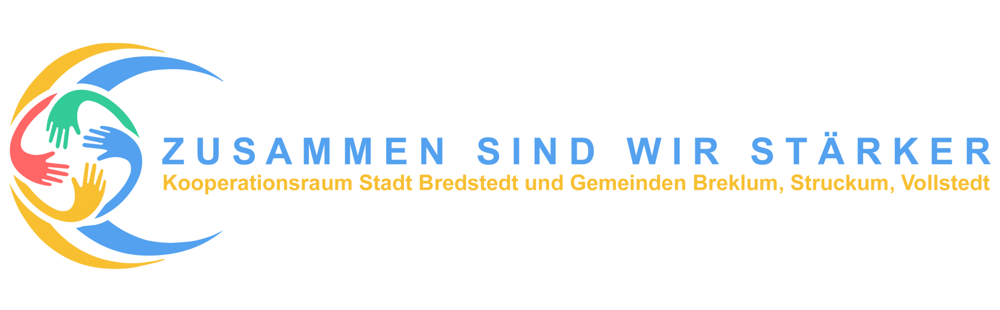

# We:Connect

[Dansk Version](README-da.md) · [English Version](README.md)

## Zusammenfassung

Unter dem vorläufigen Arbeitstitel "We:Connect" sollen aufeinander abgestimmte APIs entwickelt werden, mit denen

* ÖPNV-Anbieter
* Shuttle-Dienste
* Autovermietungen
* eBike-Verleiher
* Privatleute
* ...

ihre Routen, Verfügbarkeiten, Fahrzeiten, Kapazitäten und Preise bereitstellen können und auf deren Grundlage Apps
entwickelt werden können, die

* regionales und überregionales Routing über Anbietergrenzen hinweg ermöglichen
* einfache Buchungen erlauben
* in "Dorf-Apps" integrierbar sind
* ...

## Warum sich die Mühe machen?

Im Rahmen des Kooperationsraums der Stadt Bredstedt mit den Gemeinden Breklum, Struckum und Vollstedt entstand das
Projekt "[Smarter Marktplatz für die Mobilität der Zukunft](https://www.smarter-marktplatz-bredstedt.de/)", das sich
mit folgenden Fragen befasst:

* Wie bewegen wir uns in zehn Jahren auf dem Land fort?
* Wie können wir Mobilität ökologisch und komfortabel zugleich gestalten?
* Und wie hängt die Versorgung mit Lebensmitteln, Gesundheitsdienstleistungen und Freizeitangeboten auf dem Land mit
  Mobilität zusammen?

Es wurde sehr schnell klar, dass wir Lösungen brauchen, die zumindest den Zweitwagen auf dem Land überflüssig machen,
ohne die Mobilität einzuschränken.
Um das zu erreichen, muss sich jeder Bürger einfach über Transport-Alternativen informieren können.

Der ursprüngliche Gedanke war, eine App zu erstellen, die die regionalen Angebote zusammenfasst.
Es wurde aber sehr schnell klar, dass es unter den aktuellen Verhältnissen keine App geben kann, die das
zufriedenstellend löst: Es fehlen standardisierte Schnittstellen.

Ziel dieses Projektes ist es, eine solche Schnittstelle – genauer: eine Sammlung von Schnittstellen – zu definieren, die
allen Anbietern von Transportleistungen und allen App-Anbietern gleichermaßen offensteht.
